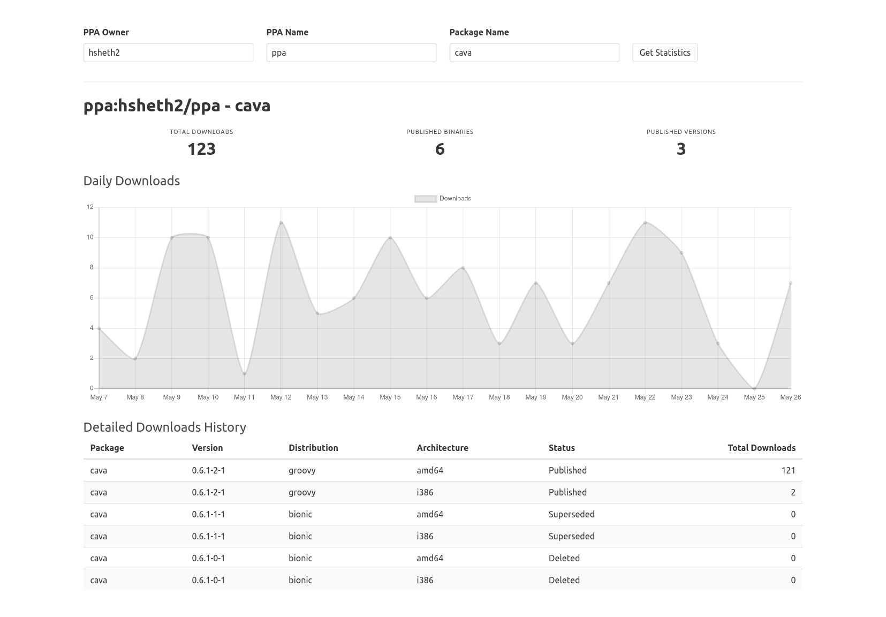

# PPA Stats Web Interface

The fastest way to view download statistics for a package published in a PPA on Launchpad.

**Try it out**: https://ppa-stats.sheth.io/

### Screenshot
Download statistics for my [cava package](https://github.com/hsheth2/cava-ppa). Live link: https://ppa-stats.sheth.io/#/?ppaName=ppa&ppaOwner=hsheth2&packageName=cava.

### Similar Work
- https://wpitchoune.net/ppastats/
- https://gist.github.com/springmeyer/2778600
- https://gist.github.com/stefansundin/f9df6c5e0fd184c60709
- https://github.com/YokoZar/ppa-stats
- https://github.com/respawner/ppa-stats
- `indicator-ppa-download-statistics` from https://launchpad.net/~thebernmeister/+archive/ubuntu/ppa/+packages

### References
- https://bugs.launchpad.net/launchpad/+bug/688141
- https://blog.launchpad.net/cool-new-stuff/tracking-ppa-download-statistics
- https://ftagada.wordpress.com/2011/01/05/ppa-stats-initial-impressions/
- https://askubuntu.com/questions/296197/how-to-find-out-the-package-download-count-from-a-ppa
- https://fosspost.org/tutorials/how-to-get-the-download-stats-of-any-ubuntu-ppa
- https://launchpad.net/+apidoc/1.0.html

### To Do
- write some notes on the technical details of it
- allow querying standard packages e.g. https://api.launchpad.net/1.0/ubuntu/+archive/primary?ws.op=getPublishedBinaries&exact_match=true&binary_name=silversearcher-ag
- use `ordered=false` on `getPublishedBinaries` for faster results
- add link to open launchpad for selected PPA
- add launchpad link for each binary/build in the table
- add footer with link back to github
- include publish/create dates in the table
- add stat for downloads limited to published packages

